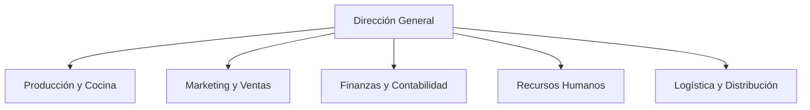
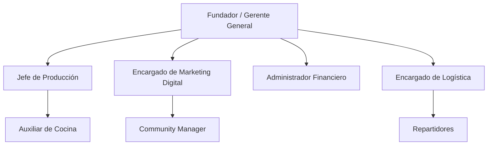

# Proyecto de Emprendimiento

- [Clase Sincrónica Martes: 19:00 — 21:00](https://teams.microsoft.com/l/meetup-join/19%3ameeting_YzNmODMyOTItYWYyMy00YmZhLTgxMDYtZmFjNzliZTkxZTA5%40thread.v2/0?context=%7b%22Tid%22%3a%22af30d315-749b-4372-816d-796ed33ee76c%22%2c%22Oid%22%3a%221c631034-0585-4166-b0c5-d69fca78fa65%22%7d)
- [Clase Sincrónica Sábado: 08:00 — 10:00](https://teams.microsoft.com/l/meetup-join/19%3ameeting_M2FkODRlMjYtOWQ1ZC00ZDIzLTlhYTQtYWIyNTM1OTE4YTFh%40thread.v2/0?context=%7b%22Tid%22%3a%22af30d315-749b-4372-816d-796ed33ee76c%22%2c%22Oid%22%3a%221c631034-0585-4166-b0c5-d69fca78fa65%22%7d)
---

- [Drive](https://isteambato-my.sharepoint.com/personal/vicente_catota_iste_edu_ec/_layouts/15/onedrive.aspx?id=%2Fpersonal%2Fvicente%5Fcatota%5Fiste%5Fedu%5Fec%2FDocuments%2FAVANCE%20SEMANA%208%20PROYECTO%202026&ga=1)

[Explicación del uso del formato](https://isteambato-my.sharepoint.com/personal/vicente_catota_iste_edu_ec/_layouts/15/stream.aspx?id=%2Fpersonal%2Fvicente%5Fcatota%5Fiste%5Fedu%5Fec%2FDocuments%2FGrabaciones%2FReuni%C3%B3n%20con%20VICENTE%20DAVID%20CATOTA%20MESIAS%2D20260126%5F095940%2DGrabaci%C3%B3n%20de%20la%20reuni%C3%B3n%2Emp4&nav=eyJyZWZlcnJhbEluZm8iOnsicmVmZXJyYWxBcHAiOiJTdHJlYW1XZWJBcHAiLCJyZWZlcnJhbFZpZXciOiJTaGFyZURpYWxvZy1MaW5rIiwicmVmZXJyYWxBcHBQbGF0Zm9ybSI6IldlYiIsInJlZmVycmFsTW9kZSI6InZpZXcifX0&ga=1&referrer=StreamWebApp%2EWeb&referrerScenario=AddressBarCopied%2Eview%2E99ab5f99%2Dd400%2D4539%2D9d78%2Db5886774e64a)

- [Grabaciones](https://isteambato-my.sharepoint.com/personal/vicente_catota_iste_edu_ec/_layouts/15/onedrive.aspx?id=%2Fpersonal%2Fvicente%5Fcatota%5Fiste%5Fedu%5Fec%2FDocuments%2FGrabaciones&FolderCTID=0x0120007B83A56E37CBED41B654C224B02B0DE4&view=0)

## Semana 01

[Clase 01 - 15 Noviembre de 2025](https://isteambato-my.sharepoint.com/personal/vicente_catota_iste_edu_ec/_layouts/15/stream.aspx?id=%2Fpersonal%2Fvicente%5Fcatota%5Fiste%5Fedu%5Fec%2FDocuments%2FGrabaciones%2FJ2%20PROYECTO%20DE%20EMPRENDIMIENTO%2D20251115%5F081001%2DGrabaci%C3%B3n%20de%20la%20reuni%C3%B3n%2Emp4&nav=eyJyZWZlcnJhbEluZm8iOnsicmVmZXJyYWxBcHAiOiJTdHJlYW1XZWJBcHAiLCJyZWZlcnJhbFZpZXciOiJTaGFyZURpYWxvZy1MaW5rIiwicmVmZXJyYWxBcHBQbGF0Zm9ybSI6IldlYiIsInJlZmVycmFsTW9kZSI6InZpZXcifX0&ga=1&referrer=StreamWebApp%2EWeb&referrerScenario=AddressBarCopied%2Eview%2E2b67c95b%2D3e24%2D4abb%2Dabdf%2D7af958189c71)

### J1 Presentación

- PAO: Periodo académico ordinario
- C1: Ciclo 1
- C2: Ciclo 2
- 8 Semanas x Ciclo

Producto Final: Plan de negocios

Plan de negocio para el fortalecimiento del talento humano en las pimes

Completar padlet

### Extra:

- Calidad
- Pareto 80-20
- Ishikawa

### J2 Presentación

Completar padlet: Tercera persona

padlet.com/david199102/j2-proyecto-de-emprendimiento-plp56zqmkd97xo6z

Modelo de negocio y nombre:

> Mi plan de negocio es una tienda virtual llamada Animalia Boutique, donde venderé alimentos, juguetes y accesorios para mascotas, con compras fáciles desde casa y entregas a domicilio.

- Colocar nombre de la empresa
- Para la creación de

> Plan de negocios de la empresa online Mabel's breakfast enfocada en la preventa de desayunos saludables.

> Plan de negocios para la creación de la empresa online Mabel's breakfast enfocada en la preventa de desayunos saludables.

matriz vcg

### Extra:

- Metodologia canva: eficiencia valor
- Business model canvas

## Semana 02

[Clase 02 - 22 de noviembre de 2025](https://isteambato-my.sharepoint.com/personal/vicente_catota_iste_edu_ec/_layouts/15/stream.aspx?id=%2Fpersonal%2Fvicente%5Fcatota%5Fiste%5Fedu%5Fec%2FDocuments%2FGrabaciones%2FJ2%20PROYECTO%20DE%20EMPRENDIMIENTO%2D20251122%5F080855%2DGrabaci%C3%B3n%20de%20la%20reuni%C3%B3n%2Emp4&nav=eyJyZWZlcnJhbEluZm8iOnsicmVmZXJyYWxBcHAiOiJTdHJlYW1XZWJBcHAiLCJyZWZlcnJhbFZpZXciOiJTaGFyZURpYWxvZy1MaW5rIiwicmVmZXJyYWxBcHBQbGF0Zm9ybSI6IldlYiIsInJlZmVycmFsTW9kZSI6InZpZXcifX0&ga=1&referrer=StreamWebApp%2EWeb&referrerScenario=AddressBarCopied%2Eview%2E7158b88e%2Dd90b%2D4b68%2D9227%2D75c86301bb9b)

### J2 The Business model canvas

padlet.com/david199102/plan-de-negocios-para-8kqjpzlom7rpe627

> Plan de negocios de la empresa online "Easy breakfast" enfocada en la preventa de desayunos saludables.

> **Plan de negocios de la empresa online "Easy Breakfast" para la preventa de desayunos saludables.**

The Business model canvas: Un lenguaje común para describir, visualizar, evaluar y cambiar modelos de negocios.

Valor: Capacidad de un producto de satisfacer una necesidad.
Es una medida arbitraria y perceptual que depende de cada cliente.

Propuesta de valor:

> Elevar la accesibilidad de alimentos saludables mediante la inclusion de un sistema web para personas que no pueden comprar de manera presencial.

### 🥗 Easy Breakfast – Preventa Online de Desayunos Saludables

📊 Business Model Canvas

1. Socios Clave  
	
	¿Quiénes son nuestros socios clave?
	
	- Proveedores mayoristas de frutas frescas
	- Proveedores de granos, yogur y frutos secos.
	- Proveedores de envases ecológicos
	- Servicio de delivery (si se terceriza)
	- Plataforma de pagos online
	
	¿Qué recursos adquirimos de ellos?
	
	- Materia prima fresca y de calidad
	- Insumos para preparación
	- Empaques biodegradables
	- Servicio logístico
	- Infraestructura tecnológica de pago
	
	¿Qué actividades realizan?
	
	- Abastecimiento constante
	- Transporte de insumos
	- Distribución de pedidos
	- Procesamiento de pagos
	
	Motivaciones para alianzas:
	
	✔ Optimización de costos
	✔ Reducción de riesgos (escasez de frutas, retrasos)
	✔ Garantía de calidad constante

2. Actividades Clave
	
	¿Qué actividades requiere nuestra propuesta de valor?
	
	- Selección y compra de frutas frescas
	- Preparación y armado de desayunos
	- Control de calidad e higiene
	- Gestión de pedidos online
	- Marketing digital
	- Coordinación de entregas
	- Atención al cliente
	
	Para los canales:
	
	- Administración de página web
	- Gestión de redes sociales
	- Coordinación con delivery
	
	Para ingresos:
	
	- Gestión de preventas
	- Gestión de pagos digitales
	- Diseño de promociones

3. Recursos Clave
	
	Para la propuesta de valor:
	
	- Cocina equipada
	- Insumos frescos
	- Marca registrada
	- Recetas saludables
	- Plataforma web
	
	Para canales:
	
	- Página web funcional
	- Redes sociales
	- Base de datos de clientes
	
	Para relaciones con clientes:
	
	- Sistema de atención (WhatsApp, chat web)
	<!-- - CRM básico -->
	
	Tipos de recursos:
	
	**🔹 Intelectuales**
	
	- Marca “Mabel’s Breakfast”
	- Base de datos de clientes
	- Recetas propias
	
	**🔹 Humanos**
	
	- Personal de cocina
	- Community manager (profesional de marketing digital responsable de construir, gestionar y administrar la comunidad online de una marca en redes sociales)
	- Repartidor
	
	**🔹 Físicos**
	
	- Cocina
	- Refrigeración
	- Utensilios
	
	**🔹 Financieros**
	
	- Capital inicial
	- Flujo de caja

4. Propuesta de Valor
	
	¿Qué valor entregamos?
	
	Desayunos saludables, frescos y listos para consumir, solicitados con anticipación desde una plataforma online.
	
	> Elevar la accesibilidad de alimentos saludables mediante la inclusion de un sistema web para personas que no pueden comprar de manera presencial.
	
	¿Qué problema resolvemos?
	
	- Falta de tiempo para preparar desayunos saludables.
	- Dificultad de acceso a opciones saludables.
	- Necesidad de planificación alimenticia.
	
	¿Qué necesidad satisfacemos?
	
	- Alimentación saludable
	- Comodidad
	- Ahorro de tiempo
	
	Características clave:
	
	✔ Accesibilidad (pedido online)
	✔ Conveniencia (entrega puntual)
	✔ Personalización (opciones según dieta)
	✔ Reducción de riesgo (preventa evita desperdicio)
	✔ Precio accesible comparado con cafeterías premium

5. Relación con Clientes
	
	> Fidelizar al cliente
	
	Tipo de relación:
	
	- Asistencia personal vía WhatsApp
	- Servicio semi-automatizado en la web
	- Programa de fidelización (descuentos por compras frecuentes)
	
	¿Qué esperan?
	
	- Respuesta rápida
	- Entrega puntual
	- Productos frescos
	- Opciones personalizadas
	
	Costos:
	
	Relativamente bajos (principalmente atención digital).
	
	Integración:
	
	Se integra con:
	
	- Página web
	- Base de datos
	<!-- - Sistema de pedidos -->

6. Canales
	
	¿Cómo llegamos a los clientes?
	
	- Página web
	- Instagram
	- Facebook
	- WhatsApp Business
	
	¿Cuál funciona mejor?
	
	- Redes sociales para captación
	- Web para cierre de venta
	
	¿Cómo se integra en la rutina?
	
	- Pedido en la noche anterior
	- Entrega temprano antes del trabajo

7. Segmentos de Clientes
	
	¿Para quién creamos valor?
	
	- Adultos ejecutivos
	- Personas que trabajan en oficina
	- Estudiantes universitarios
	- Personas que cuidan su alimentación
	
	Tipo de mercado:
	
	✔ Nicho de mercado
	Enfocado en personas con interés en alimentación saludable y poco tiempo disponible.
	
	Clientes más importantes:
	
	- Profesionales de 25–45 años
	- Personas con ingresos medios

8. Estructura de Costos
	
	Costos más importantes:
	
	- Compra de frutas e insumos
	- Mano de obra
	- Delivery
	- Marketing digital
	- Hosting y mantenimiento web
	
	Recursos más costosos:
	
	- Insumos frescos
	- Personal
	
	Actividades más costosas:
	
	- Preparación diaria
	- Logística de entrega
	
	Tipo de negocio:
	
	🔹 Más enfocado al valor
	(No compite por ser el más barato, sino por calidad, frescura y conveniencia)

9. Fuente de Ingresos
	
	¿Por qué pagan?
	
	- Comodidad
	- Ahorro de tiempo
	- Alimentación saludable
	- Entrega puntual
	
	¿Cómo pagan?
	
	- Transferencia bancaria
	- Tarjeta
	- Pago móvil
	- Efectivo contra entrega
	
	Tipo de ingresos:
	
	✔ Venta directa de producto
	✔ Posible suscripción semanal/mensual
	✔ Descuentos por volumen
	
	Tipo de precios:
	
	🔹 Precios fijos según tipo de desayuno
	🔹 Descuentos por volumen
	🔹 Promociones dinámicas en fechas especiales

### 🎯 Extra

Puedes mencionar que el modelo de preventa:

- Reduce desperdicio
- Permite mejor planificación de compras
- Mejora flujo de caja
- Disminuye pérdidas por productos perecibles

Eso le da un enfoque estratégico.

### Resumen

Buenos días.

Mi proyecto se titula **“Plan de negocios de la empresa online Mabel’s Breakfast para la preventa de desayunos saludables”**.

Mabel’s Breakfast es una empresa digital enfocada en ofrecer desayunos saludables mediante un sistema de preventa online. La idea nace al identificar un problema común: muchas personas, especialmente ejecutivos y trabajadores de oficina, no tienen tiempo para preparar un desayuno saludable antes de ir a trabajar.

Nuestra solución es una plataforma web donde los clientes pueden reservar su desayuno con anticipación y recibirlo fresco y puntual en su domicilio o lugar de trabajo.

El modelo de preventa nos permite:

- Planificar mejor las compras
- Reducir desperdicios
- Optimizar costos
- Garantizar frescura

Nuestro público objetivo son adultos entre 25 y 45 años, profesionales que valoran su salud pero tienen poco tiempo disponible.

La propuesta de valor se basa en tres pilares:

- Alimentación saludable
- Comodidad
- Entrega puntual

El modelo de ingresos se basa principalmente en la venta directa de desayunos, con posibilidad de implementar suscripciones semanales o mensuales.

En conclusión, Mabel’s Breakfast no solo busca vender desayunos, sino ofrecer una solución práctica y saludable para personas con un estilo de vida ocupado.

Muchas gracias.

## Semana 03

[Clase 03 - 29 de Noviembre de 2025](https://isteambato-my.sharepoint.com/personal/vicente_catota_iste_edu_ec/_layouts/15/stream.aspx?id=%2Fpersonal%2Fvicente%5Fcatota%5Fiste%5Fedu%5Fec%2FDocuments%2FGrabaciones%2FJ2%20PROYECTO%20DE%20EMPRENDIMIENTO%2D20251129%5F080804%2DGrabaci%C3%B3n%20de%20la%20reuni%C3%B3n%2Emp4&nav=eyJyZWZlcnJhbEluZm8iOnsicmVmZXJyYWxBcHAiOiJTdHJlYW1XZWJBcHAiLCJyZWZlcnJhbFZpZXciOiJTaGFyZURpYWxvZy1MaW5rIiwicmVmZXJyYWxBcHBQbGF0Zm9ybSI6IldlYiIsInJlZmVycmFsTW9kZSI6InZpZXcifX0&ga=1&referrer=StreamWebApp%2EWeb&referrerScenario=AddressBarCopied%2Eview%2Eff2ee35d%2Dace4%2D4328%2D8d94%2D47b7ec8d1c55)

### J2 Misión, Visión y Valores

Pilares de la identidad corporativa

> **Misión:** Define la razón de ser de la empresa en el presente. Responde a ¿quiénes somos?, y ¿qué hacemos?  

> **Visión:** Proyecta la imagen futura de la organización. Responde a ¿hacia dónde vamos?, y ¿qué queremos lograr? También ¿Qué? ¿Qué resultado quieres lograr con tu empresa? ¿Qué resultado obtendrás si te comprometes con lo que quieres hacer?

> **Valores:** Principios éticos y culturales que guían el comportamiento. Responde a ¿en qué creemos?

#### Misión Personal

1. ¿Quién soy?
	
	- Belén Valenzuela estudiante de Administración y Emprendimiento comprometida con la mejora continua.
	- Soy una persona dedicada que mejora día con día.
	
2. ¿Cómo lo hago?
	
	- Con disciplina y constancia.
	- Con trabajo y esfuerzo
	
3. ¿Para qué lo hacemos?
	
	- Para no quedarme rezagada tanto en el ámbito personal como profesional.
	- Porque la fortuna favorece al valiente.
	

> Belén Valenzuela estudiante de Administración y Emprendimiento comprometida con la mejora continua, con disciplina y constancia para no quedar rezagada tanto en el ámbito personal como profesional.  

> Soy una persona dedicada que mejora día a día, con trabajo y esfuerzo porque la fortuna favorece al valiente.

#### Misión Empresarial

Ejemplo:

1. ¿Quiénes somos?
	
	Empresa XYZ es una comercializadora de insumos tecnológicos importados. Somos una organización dedicada a la confección de zapatos de alta gama.
	
	- Somos una empresa dedicada a la producción de perfiles de aluminio.
	- Somos una empresa dedicada a solucionar y que unen comunicaciones.
	
	XYZ se dedica a brindar soluciones estratégicas en tecnología y comunicación empresaria.
	
	Somos una empresa tecnológica que se dedica a brindar soluciones integrales en comunicación empresarial.

2. ¿Cómo lo hacemos?
	
	Mediante la elección de los mejores proveedores internacionales con la mejor materia prima del centro de país y acabados de primera.
	
	- Eligiendo materia prima de calidad y acabados de diversas preferencias.
	
	Evaluando exhaustivamente los inconvenientes diarios de la empresa en el ámbito de la comunicación y para tareas y resolver proceso e inconvenientes.
	
	Evaluando condiciones criticas a nivel estratégico dentro de procesos inherentes.

2. ¿Para qué lo hacemos?
	
	Con la finalidad de satisfacer los requerimeintos de nuestros clientes.
	Para satisfacer las necesidades de nuestros clientes y público en general.
	
	- Enfocados a satisfacer las necesidades de la contrucción y semejantes.

Ejemplos:

Google: Organizar la información del mundo para que sea útil y accesible para todos.

### 🥗 Easy Breakfast

#### Misión

Pasos para definir la misión (pág. 15)

1. Identidad – ¿Quiénes somos?
	
	Somos una empresa online dedicada a la preventa de desayunos saludables, enfocada en personas con poco tiempo que buscan alimentación práctica y de calidad.

2. Actividades – ¿Qué hacemos?
	
	Preparamos y comercializamos desayunos saludables bajo modalidad de preventa, utilizando una plataforma web para facilitar el pedido, el pago y la entrega puntual.

3. Finalidad – ¿Para quién lo hacemos?
	
	Para profesionales, estudiantes y personas que desean mantener una alimentación saludable sin perder tiempo en la preparación.

> **Easy Breakfast es una empresa online dedicada a la preventa de desayunos saludables, ofreciendo productos frescos y accesibles mediante una plataforma digital que facilita el pedido y la entrega puntual para personas con poco tiempo que buscan alimentarse mejor.**  

> **Ofrecer desayunos saludables de alta calidad mediante una plataforma digital que facilite el pedido a personas con poco tiempo.**

#### Visión

Siguiendo los lineamientos del documento: positiva, breve, alcanzable, medible, entendible y con temporalidad (pág. 25)

**Ser en cinco años la empresa referente en preventa de desayunos saludables en nuestra ciudad, reconocida por su puntualidad, calidad y uso eficiente de tecnología para facilitar una alimentación saludable y sostenible.**

#### Valores

Se desprenden de la misión y visión:

1. Honestidad
2. Calidad: Compromiso con ingredientes frescos y preparación responsable.
3. Puntualidad: Entrega oportuna como parte central del servicio.
4. Innovación: Uso de tecnología para facilitar el acceso a la alimentación saludable.
5. Compromiso con el cliente: Atención cercana y enfoque en sus necesidades.
6. Responsabilidad: Reducción de desperdicio mediante el sistema de preventa y uso de empaques adecuados.

Nota: 5 o 6 valores como máximo.

### El Proceso de Creación

1. Diagnóstico

	Analiza la situación actual, fortalezas y el propósito fundamental de los fundadores.

2. Brainstorming 

	Sesiones colaborativas con el equipo clave para generar ideas y palabras clave.

3. Redacción

	Sintetiza las ideas en frases cortas, memorables y potentes. Menos es más.

4. Validación

	Prueba las declaraciones con empleados y clientes. ¿Son auténticas? ¿Inspiran?

## Semana 04

[Clase 04 - 2 de Diciembre de 2025](https://isteambato-my.sharepoint.com/personal/vicente_catota_iste_edu_ec/_layouts/15/stream.aspx?id=%2Fpersonal%2Fvicente%5Fcatota%5Fiste%5Fedu%5Fec%2FDocuments%2FGrabaciones%2FJ1%20PROYECTO%20DE%20EMPRENDIMIENTO%2D20251202%5F190522%2DGrabaci%C3%B3n%20de%20la%20reuni%C3%B3n%2Emp4&nav=eyJyZWZlcnJhbEluZm8iOnsicmVmZXJyYWxBcHAiOiJTdHJlYW1XZWJBcHAiLCJyZWZlcnJhbFZpZXciOiJTaGFyZURpYWxvZy1MaW5rIiwicmVmZXJyYWxBcHBQbGF0Zm9ybSI6IldlYiIsInJlZmVycmFsTW9kZSI6InZpZXcifX0&ga=1&referrer=StreamWebApp%2EWeb&referrerScenario=AddressBarCopied%2Eview%2Eee3a1b84%2D7278%2D4f62%2D83e7%2D5267ae4798c1)

### J1 Arquetipos y Branding

> La marca es aquello que dicen de ti cuando no estás.  
> Jeff Bezos

Arquetipos de Marca

Organizan la realidad y agregan estructura a las marcas, además dan vida a la narrativa de la marca y ayudan a crear storytelling atractivo. Carl JUng.

¿En qué arquetipo encaja mi marca?

1. Inocente

	- Lema: Libertad para ser tú mismo.
	- Deseo básico: Llegar al paraíso.
	- Objetivo: Ser feliz
	- Mayor temor: Ser castigado por hacer algo incorrecto
	- Estrategia: Hacer las cosas bien
	- Talento: La fe y el optimismo

2. El explorador

	- Lema: No me encierres
	- Deseo básico: Libertad para descubrir
	- Objetivo: Experimentar un mundo mejor, más auténtico, la vida más plena.
	- Mayor temor: El vacío de quedar atrapado, conformidad.
	- Estrategia: Viajar y experimentar cosas nuevas, escapar del aburriento.
	- Talento: Autonomía, ambición, ser fiel a su propia alma.

3. El sabio

	- Lema: La verdad lo hace libre
	- Deseo básico: Encontrar la verdad
	- Objetivo: Utilizar la inteligencia y análisis para entender el mundo.
	- Mayor temor: Ser engañado, la ignorancia
	- Estrategia: La búsqueda de información y conocimiento, la auto-reflexión y la comprensión
	- Talento: Sabiduría, inteligencia.

4. El Héroe

	- Lema: Donde hay voluntad, hay camino
	- Deseo básico: Demostrar la propia valía a través de actos valientes
	- Objetivo: Superarse a sí mismo y mejorar el mundo con sus actos
	- Mayor temor: La debilidad, ser cobarde
	- Estrategia: Ser tan fuerte y competente posible
	- Talento: La competencia y la valentía

5. El forajido (Fuera de la ley)

	- Lema: Las reglas están para romperse
	- Deseo básico: La revolución
	- Objetivo: Derrocar lo que no funciona
	- Mayor temor: Ser imponente o incapaz
	- Estrategia: Interrumpir, llamar la atención
	- Talento: Libertad, extravagancia

6. El Mago

	- Lema: Puede hacer que las cosas sucedan
	- Deseo básico: Equilibrar los sucesos preparados y enfrentar los retos.
	- Objetivo: Hacer que los sueños se hagan realidad
	- Mayor temor: Consecuencias negativas
	- Estrategia: Desarrollar una visión y vivir por ella
	- Talento: Buscar soluciones en todo momento

7. El Amante

	- Lema: Tu eres el elegido
	- Deseo básico: La intimidad y la experiencia.
	- Objetivo: Estar en relación con personas, trabajo y el entorno.
	- Mayor temor: La soledad, no ser amado
	- Estrategia: Llegar a ser cada vez más atractivo física y emocionalmente
	- Talento: La pasión, gratitud, compromiso

8. El Bufón

	- Lema: Solo se vive una vez
	- Deseo básico: Disfrutar el momento al máximo
	- Objetivo: Pasar un buen rato
	- Mayor temor: Ser un aburrido
	- Estrategia: Jugar, hacer bromas, ser gracioso
	- Talento: Alegría

9. El Gobernante

	- Lema: El poder no lo es todo, es lo único.
	- Deseo básico: Control
	- Objetivo: Éxito, distinción
	- Mayor temor: El caos, ser derrocado
	- Estrategia: Ejercicio del poder
	- Talento: Responsabilidad, liderazgo

Para los 3 que faltan revisar el siguiente enlace.

- [La Teoría de los ARQUETIPOS de PERSONALIDAD de Carl Jung](https://www.youtube.com/watch?v=eyrtNcRFcY0)
- [Brandemia](https://brandemia.org/arquetipos-de-marca)

### 🥗 Easy Breakfast - Arquetipos

Contexto estratégico de Easy Breakfast

- Alimentación saludable
- Conveniencia (preventa + delivery)
- Público consciente (fitness, profesionales, estudiantes)
- Bienestar físico y posiblemente sostenibilidad
- Puede tener un tono corporativo/elegante, pero accesible

Desde el enfoque del **Business Model Canvas** Business Model Generation, mi Propuesta de Valor combina:

- Conveniencia
- Bienestar
- Desempeño (energía, productividad)
- Posible diferenciación por calidad

Y desde la guía de misión/visión (archivo que revisamos en clase), mi proyecto claramente apunta a propósito + impacto en bienestar.

#### Arquetipos

Easy Breakfast:

- Cuida la salud del cliente
- Se preocupa por su bienestar diario
- Facilita su rutina
- Puede tener enfoque preventivo (nutrición inteligente)
- Puede integrar sostenibilidad

🔥 **El Cuidador:**

- Quiere proteger y ayudar
- Se enfoca en bienestar y seguridad
- Transmite confianza
- Tiene tono cálido y empático

	Eslogan:
	
> 	"Nos encargamos de tu desayuno para que tú te encargues de conquistar el día."

Nota: Este arquetipo genera confianza y es ideal para sector alimentación saludable.

🔥 **El Héroe (Complementario):** 

- Superación
- Fuerza
- Rendimiento
- Disciplina

Nuestra marca comunica:

- Energía para rendir
- Productividad
- Alto desempeño
- Mentalidad ganadora

Por eso he decidido usar: Cuidador (emocional)  +  Héroe (motivacional)

	Eslogan:
	
> 	"Alimenta tu disciplina. Empieza fuerte."

Otros tipo de mensajes:

- “Empieza bien tu día.”
- “Nutrición que te impulsa.”
- “Tu mejor versión comienza en la mañana.”
- Construye tu cuerpo, comiendo...

## Semana 05

[Clase 05](https://isteambato-my.sharepoint.com/personal/edison_narvaez_iste_edu_ec/_layouts/15/stream.aspx?id=%2Fpersonal%2Fedison%5Fnarvaez%5Fiste%5Fedu%5Fec%2FDocuments%2FGrabaciones%2FPROYECTOS%20DE%20EMPRENDIMIENTO%20%2D%20CLASE%20SINCRONICA%20S%C3%A1bados%201100%20%2D%201300%2D20250614%5F110345%2DGrabaci%C3%B3n%20de%20la%20reuni%C3%B3n%2Emp4&nav=eyJyZWZlcnJhbEluZm8iOnsicmVmZXJyYWxBcHAiOiJTdHJlYW1XZWJBcHAiLCJyZWZlcnJhbFZpZXciOiJTaGFyZURpYWxvZy1MaW5rIiwicmVmZXJyYWxBcHBQbGF0Zm9ybSI6IldlYiIsInJlZmVycmFsTW9kZSI6InZpZXcifX0&ga=1&referrer=StreamWebApp%2EWeb&referrerScenario=AddressBarCopied%2Eview%2Edb424fe0%2D527d%2D4e7e%2Da6ea%2Db7ee60678bae)

### J2 Mercadeo

- Investigación de mercado
- Segmentar el mercado
- Grupos similares y más pequeños
- Caracteristicas y necesidades similares

En mercadeo (marketing), el mercado es el **conjunto de compradores actuales y potenciales que tienen una necesidad, el deseo y la capacidad económica (poder adquisitivo) para adquirir un producto o servicio**. Es el grupo hacia el cual se dirigen las estrategias de comercialización, segmentación y venta para intercambiar valor. 

**Segmentación:** El mercado total se divide en segmentos específicos para dirigir los esfuerzos de marketing con mayor precisión.

Debemos segmentar porque todo el mundo no consume nuestros productos.

Beneficios

- Identificar las necesidades específicas de los consumidores
- Estrategias de MK mejor focalizadas
- Comunicación publicitaria más efectiva
- Detectar nichos de mercado
- Facilita la medición de resultados
- Identificación de mercados más rentables 

Tipos de segmentación de mercados

- Geográfica
- Demográfica
	- Edad
	- Sexo
	- Nivel educativo
	- Ingreso
	- Profesión
	- Tamaño de la familia
	- Nivel Socioeconómico
	- Etnia
	- Nacionalidad
	- Religion
- Psicográfica
	- Personalidad
	- Estilo de vida
	- Actitudes
	- Valores
- Conductual
	- Búsqueda del beneficio
	- Frecuencia de uso (porcentaje)
	- Fidelidad de la marca
	- Utilización del producto
	- Nivel de "Listo para consumir"
	- Toma de decisión (por uno y no otro)

Mercado total
Mercado potencial
Mercado objetivo

### 🥗 Easy Breakfast - Segmentación de Mercado

#### 1. Segmentación Geográfica
	
- **Ubicación:** Ciudad de Quito
- **Justificación con datos del INEC:**
	- Población 2022: **2.679.722 habitantes**
	- Crecimiento promedio anual (2010–2022): **1,48 %**
	- Densidad poblacional: **6,4 hab./ha**
	- 68 % viviendas en zona urbana

Easy Breakfast se enfocará en:

- **zonas urbanas de alta densidad**
	- Parroquia estratégica (alta concentración):
		- Iñaquito 42.822 habitantes

Esto es ideal para modelo delivery por:

- Alta concentración = menor costo logístico
- Mayor volumen potencial de pedidos

#### 2. Segmentación Demográfica

- Edad: Según el INEC:
	
	- Edad promedio en Quito (2022): **34 años**
	- Grupo 0–14 años disminuye (21,3 %)
	- Grupo 15–29 años: 25 %
	- Mayor tendencia al envejecimiento

Mercado ideal para Easy Breakfast:

- 20 a 45 años
	
	- Jóvenes profesionales
	- Universitarios
	- Personas activas laboralmente

Este grupo:

- Tiene poder adquisitivo propio
- Compra por conveniencia
- Usa apps y redes sociales

- Sexo
	
	- No existe una diferencia marcada, pero:
	- 37,7 % de hogares tienen jefatura femenina (2022)

Estrategia:

- Comunicación neutra
- Enfoque en mujeres profesionales (segmento fuerte en decisiones alimentarias)

- Nivel educativo
	
	Aunque el INEC no detalla niveles educativos específicos, por contexto urbano de Quito:
	
	- Alta concentración de población con educación secundaria y superior
	- Zonas como Iñaquito y Cumbayá concentran población universitaria y profesional

Enfoque:

- Personas con conciencia nutricional
- Profesionales que valoran alimentación saludable

- Ingreso y Nivel Socioeconómico
	
	Datos indirectos relevantes:
		
	- 33,7 % de hogares viven en arriendo → movilidad laboral
	- 46,5 % vivienda propia
	- Crecimiento en departamentos (49,8 % en 2022 vs 27,4 % en 2001)

Interpretación:

- Crecimiento de clase media urbana
- Jóvenes independientes
- Profesionales que viven solos o en pareja

Target:

- Nivel socioeconómico medio y medio-alto
- Ingresos estables

- Profesión (Ideal):
	
	- Oficinistas
	- Empleados públicos
	- Profesionales independientes
	- Freelancers
	- Emprendedores

- Tamaño de la familia - Datos INEC:
	
	- Promedio personas por hogar (2022): **3,06**
	- 17,8 % hogares unipersonales
	- 21,6 % hogares de 2 personas
	- 22,5 % hogares de 3 personas

Target:

✔ Personas que viven solas  
✔ Parejas jóvenes sin hijos

Perfecto para desayunos individuales premium.

- Etnia, Nacionalidad y Religión: No relevantes.

#### 3. Segmentación Psicográfica

- Personalidad
	
	- Personas disciplinadas
	- Orientadas a metas
	- Productivas
	- Interesadas en bienestar

- Estilo de vida
	
	- Activos
	- Fitness
	- Vida laboral intensa
	- Poco tiempo para cocinar
	- Uso frecuente de delivery

- Actitudes
	
	- Valoran conveniencia
	- Dispuestos a pagar más por calidad
	- Interés en alimentación saludable
	- Preocupación por imagen y salud

- Valores
	
	- Salud
	- Eficiencia
	- Productividad
	- Cuidado personal
	- Bienestar

#### 4. Segmentación Conductual

- Búsqueda del beneficio
	
	El cliente busca:
	
	- Ahorro de tiempo
	- Comodidad
	- Desayuno equilibrado
	- Imagen saludable
	- Energía para el día

- Frecuencia de uso
	
	Podría dividirse en:
	
	- 40 % consumo 2–3 veces por semana
	- 30 % consumo ocasional (fines de semana)
	- 30 % consumo diario (clientes fitness u oficina)

- Fidelidad de marca
	
	Alta si:
	
	- Se implementan planes semanales
	- Suscripciones mensuales
	- Programas de puntos

- Nivel “listo para consumir”
	
	Muy alto.
	
	El cliente:  
	✔ No quiere cocinar  
	✔ No quiere lavar  
	✔ Quiere entrega rápida

- Toma de decisión
	
	Elige Easy Breakfast por:
	
	- Conveniencia
	- Imagen premium
	- Diseño atractivo
	- Rapidez
	- Recomendaciones sociales

#### Cálculo de Mercado

🔹 Mercado Total:

Población Iñaquito 2019: **42.822 personas**

🔹 Mercado Potencial

Sabemos que:

- De 20 a 45 años son
	
	- Jóvenes profesionales
	- Universitarios
	- Personas activas laboralmente

- Iñaquito tiene:
    
    - Alta proporción de departamentos (90,3 %)
    - Hogares pequeños (2,12 personas promedio)

Esto indica:  
✔ Zona urbana profesional  
✔ Muchos jóvenes independientes  
✔ Alta población económicamente activa

🔹 Estimación razonable:

Supongamos que:

- 55 % están entre 20 y 45 años
- De ellos, 80 % pertenecen a población económicamente activa

Cálculo:

42.822 × 55 % = 23.552  
23.552 × 80 % ≈ **18.841 personas**

👉 **Mercado Potencial ≈ 18.841 personas**

Este grupo:

- Trabaja
- Tiene ingresos
- Puede pagar delivery

🔹 Mercado Objetivo

Ahora filtramos por:

- Nivel socioeconómico medio y medio-alto
- Interés en alimentación saludable
- Disposición a pagar por conveniencia

Iñaquito es una zona:  

✔ Empresarial  
✔ Oficinas  
✔ Centros comerciales  
✔ Vivienda vertical

Podemos asumir conservadoramente:

- 40 % tienen poder adquisitivo medio–alto y de estos
- 35 % están interesados en alimentación saludable

Cálculo:

18.841 × 40 % = 7.536  
7.536 × 35 % ≈ **2.637 personas**

👉 **Mercado Objetivo Realista ≈ 2.600 personas**

Resultado Final Ajustado

|Nivel de Mercado  |Cantidad |
|------------------|---------|
|Mercado Total     |42.822   |
|Mercado Potencial |~18.800  |
|Mercado Objetivo  |~2.600   |

Para un emprendimiento de desayunos:

Si solo se capta el 10 % del mercado objetivo:

2.600 × 10 % = 260 clientes frecuentes

Si 260 personas compran:

- 3 veces por semana
- Ticket promedio $5

260 × 3 × 4 semanas × $5  
= **$15.600 mensuales**

Y eso solo en Iñaquito.

#### Conclusión Estratégica

Easy Breakfast por el momento NO será un negocio masivo.

Debe posicionarse como:

✔ Marca urbana  
✔ Saludable  
✔ Premium accesible  
✔ Enfocada en profesionales  
✔ Especializada en delivery eficiente

El mejor enfoque es:

- Nicho segmentado urbano profesional  
- Modelo por suscripción semanal  
- Comunicación moderna y fitness

## Semana 06

[Clase 06](https://isteambato-my.sharepoint.com/personal/edison_narvaez_iste_edu_ec/_layouts/15/stream.aspx?id=%2Fpersonal%2Fedison%5Fnarvaez%5Fiste%5Fedu%5Fec%2FDocuments%2FGrabaciones%2FPROYECTOS%20DE%20EMPRENDIMIENTO%20%2D%20CLASE%20SINCRONICA%20S%C3%A1bados%201100%20%2D%201300%2D20250621%5F110850%2DGrabaci%C3%B3n%20de%20la%20reuni%C3%B3n%2Emp4&nav=eyJyZWZlcnJhbEluZm8iOnsicmVmZXJyYWxBcHAiOiJTdHJlYW1XZWJBcHAiLCJyZWZlcnJhbFZpZXciOiJTaGFyZURpYWxvZy1MaW5rIiwicmVmZXJyYWxBcHBQbGF0Zm9ybSI6IldlYiIsInJlZmVycmFsTW9kZSI6InZpZXcifX0&ga=1&referrer=StreamWebApp%2EWeb&referrerScenario=AddressBarCopied%2Eview%2E75c1a165%2D4c51%2D4b90%2Dab95%2D5d709f9510e8)

### J2 Estrategias de Mercadeo

Marketing Mix

Las 4P del Marketing

1. Producto
2. Precio
3. Plaza
4. Promoción

#### Producto

Eje central de cualquier estrategia comercia. Valor tangible o intangible.

- Tipo de producto
- Características
- Beneficio que aporta al usuario
- Valor diferencial que lo destaca

La propuesta de valor: Es la base del modelo de negocio, es el pilar para atraer y retener clientes.

El Posicionamiento debe estar en la mente de los clientes.

> 	Garantizar disponibilidad de alimentos saludables y de calidad a personas que les importa su salud.

> 	Garantizar disponibilidad de alimentos saludables y de calidad.

Ejemplos reales de propuestas de valor:

- Starbucks: Crear una experiencia alrededor del consumo de café.
- Coca-Cola: Marcar la diferencia en la vida de las personas, refrescando al mundo.

Una propuesta de valor efectiva permite ofrecer una buena experiencia al cliente y un trato personalizado. 

Características de la propuesta de valor:

- Es clara: Con el fin de entender de manera concreta lo que se ofrece.
- Es breve: Debe resumir en pocas palabras que ofrece la marca al consumidor. Debe leerse en 5 segundos.
- Es concreta: Debe indicar qué beneficio obtendrá el cliente.

#### Precio

Representa el valor monetario que el cliente debe pagar. Una fijación de precio inadecuada puede impactar de forma negativa en la demanda y reducir las oportunidades de venta.

Para establecer un precio competitivo y rentable, hay que llevar a cabo las siguientes acciones:

- Realizar un estudio de mercado
- Analizar la estrategia de precios de la competencia
- Conocer el poder adquisitivo del público objetivo

Estrategia de precios

- Definir los objetivos del emprendimiento  
	¿Qué quiere lograr con su política de precios?  
	- Maximizar las utilidades
	- Aumentar la participación de mercado
	- Posicionarse como un producto premium
	- Sobrevivir (en mercado muy competitivo o en crisis)
	- Desalentar a nuevos competidores

- Conocer los costos  
	Debe tener claro el costo total del producto o servicio:  
	- Costos fijos (alquiler, sueldo, servicios)
	- Costos variables (materias primas, comisiones)
	
	Esto asegura que el precio cubra los costos y genere utilidad.  
	Precio mínimo = Costos totales + Margen de ganancia deseado

- Analizar el mercado y la competencia  
	Estudiar:  
	- ¿Cuánto están cobrando sus competidores?
	- ¿Qué valor percibe el cliente en su producto frente a los demás?
	- ¿Cuál es el rango de precios aceptable para tu segmento de mercado?
	
	Esto le permitirá ubicarse mejor dentro del mercado:  
	Precio superior (estrategia premium)  
	Precio igual (estrategia de paridad - valor agregado)  
	Precio inferior (estrategia de penetración)

- Segmentar a sus clientes y evaluar su sensibilidad del precio  
	No todos los clientes reaccionan igual:  
	- Algunos buscan preico bajo
	- Otros valoran calidad, marca o servicio adicional  
	
	Se puede aplicar precios diferenciados (por volumen, por región, por canal)

- Elegir su estrategia de precios  
	Algunos ejemplos de estrategias:  
	- Precios de penetración: bajos para ganar mercado rápido
	- Precios premium o de prestigio: altos para transmitir exclusividad
	- Precios de descremado: precios altos al inicio y bajarlos progresivamente
	- Precios psicológicos: como $9.99 en lugar de $10.00
	- Precios por paquete o bundling: agrupar productos / servicios a un precio especial

- Monitorear y Ajustar  
	El mercado cambia. hacer seguimiento a  
	- Ventas y rentabilidad
	- Reacción de la competencia
	- Opinión de los clientes
	- Costos de producción
	
	Ajustar sus precios, es necesario para no perder competitividad

	Ejemplo:  
	Venta de cerveza:  
	- Costo de producción + distribución = $1.20
	- Su margen deseado = 50%
	- Precio = 1.20 x 0,60 = $1.80
	
	Verificar que el mercado acepta un rango de $1.70 - $2.00, entonces su precio está alineado

Modelo de comunicación empática aplicado al negocio.

[4 "P" del Marketing](https://asana.com/es/resources/4-ps-of-marketing)

### 🥗 Easy Breakfast: Las 4 P’s del _Marketing mix_

#### 1. Producto: ¿Qué vendes y por qué importa?)

El producto es aquello que ofreces para resolver una necesidad del cliente, ya sea un bien físico o un servicio. Debes entender **qué problema resuelve tu producto, quién lo quiere y qué lo hace diferente**.

**Definición:** 

Servicio de desayunos saludables y rápidos, ideal para personas ocupadas que quieren cuidar su salud.

Easy Breakfast es un servicio de desayunos saludables preparados bajo modalidad de preventa y entregados a domicilio en el sector de Iñaquito, dirigido a personas ocupadas que desean alimentarse de manera nutritiva sin perder tiempo.

**Beneficio principal:** ¿Qué problema resuelvo?

✔ Permite a personas ocupadas acceder a un desayuno saludable y equilibrado sin invertir tiempo en prepararlo.

Problema: Falta de tiempo + mala alimentación.  
Solución: Desayuno saludable listo y entregado.

**Valor diferencial:**

✔ Desayunos preparados con ingredientes frescos y seleccionados, diseñados para aportar energía y bienestar, con entrega rápida y puntual dentro del sector de Iñaquito.

Otro:

✔ Ofrecemos desayunos funcionales diseñados para aportar energía sostenida durante la mañana, diferenciándonos de las opciones tradicionales altas en azúcar y ultraprocesados.

- Personalización del desayuno.
- Información calórica visible.
- Historial de consumo en la web.
- Entrega temprana lista para llevar (no requiere calentarse).
- Enfoque preventa → frescura garantizada.
- Bebidas tradicionales nutritivas poco explotadas (ej. ponche de habas).

**Propuesta de valor:**

✔ “Desayunos saludables y listos para ti, sin perder tiempo.”

Otro:

✔ “Alimentación saludable, rápida y entregada donde estés.”  
✔ “Desayunos saludables personalizados, listos antes de que empiece tu día.”

> “Desayunos saludables, deliciosos y rápidos para quienes cuidan su bienestar sin sacrificar tiempo.”  

#### 2. Precio: ¿Cuánto cobras?

El precio debe reflejar **valor percibido + competencia + costos internos**. Es clave alinear coste con lo que el cliente está dispuesto a pagar.

**Costos:**

Operación de **20 días al mes** (lunes a viernes).

1. Análisis de Costos Fijos y Variables

Costos Operativos Mensuales (Fijos)

|**Concepto**               |**Costo Detalle**                    |**Total Mensual** |
|---------------------------|-------------------------------------|------------------|
|**Mano de Obra**           |2 personas ($30/día x 20 días)       |$600.00           |
|**Transporte (Logística)** |$12.45 ida y vuelta x 20 días        |$249.00           |
|**Servicios Básicos**      |Agua ($35) + Electricidad ($15)      |$50.00            |
|**Gas**                    |2 balones al mes (estimado)          |$8.00             |
|**Marketing Digital**      |WhatsApp Business / Fotos (estimado) |$10.00            |
|**TOTAL FIJO**             |                                     |**$917.00**       |

Costos de Insumos (Variables por Unidad)

Costo de producción **por combo** de Hotcakes + Ponche.

|**Ingrediente/Insumo** |**Costo estimado por porción**|**Notas**                                    |
|-----------------------|------------------------------|---------------------------------------------|
|**Base Hotcakes**      |$0.45                         |Avena, huevo, plátano, agua, estevia.        |
|**Toppings**           |$0.35                         |Fresas, mantequilla de maní, etc.            |
|**Ponche de Habas**    |$0.50                         |Harina, huevo, leche, especias.              |
|**Empaques**           |$0.30                         |Contenedor biodegradable + vaso + servilleta.|
|**TOTAL VARIABLE**     |**$1.60**                     |**Costo de producción por combo.**           |

2. Estrategia de Precios Sugerida

- **Combo Simple (Hotcakes + Topping básico):** **$3.50** (Margen: $1.90)
- **Combo Completo (Hotcakes + Ponche):** **$4.50** (Margen: $2.90)
- **Combo Premium (Extras: Proteína/Yogurt):** **$5.50** (Margen: $3.50)

3. Punto de Equilibrio: ¿Cuánto debo vender?

Para cubrir los **$917.00** de costos fijos mensuales con un margen promedio de **$2.90** por desayuno:

|**Periodo**     |**Meta de Ventas (Unidades)**|**Ingreso Estimado**|
|----------------|-----------------------------|--------------------|
|**Al Mes**      |316 desayunos                |$1,422.00           |
|**A la Semana** |79 desayunos                 |$355.50             |
|**Al Día**      |**16 desayunos**             |**$72.00**          |

Costo total de los combos: $1.60 x 316 = **$505.6**

> **Nota crítica:** Con **16 ventas al día** apenas se cubren gastos (punto de equilibrio). Para empezar a ver una ganancia real, se debe apuntar a **25-30 desayunos diarios**.

4. Otros egresos a considerar

- **Empaques:** La gente valora que el empaque sea resistente y, si es posible, ecológico.
- **Mermas:** Siempre hay una fresa que se daña o harina que se derrama. Se debe calcular un **5% de pérdida** en tus compras.
- **Mantenimiento:** Las licuadoras y sartenes se desgastan. Se debe guardar unos $5-$10 al mes para reposiciones.
- **Publicidad física:** Volantes o código QR en la mochila de reparto para que guarden a Easy Breakfast en WhatsApp.
 
El servicio incluye:

- Personalización
- Entrega
- Conteo calórico
- Preparación fresca

Este no es un desayuno común.

✔ **Estudio de mercado:**

- ¿Cuánto cuestan otros desayunos saludables en tu ciudad?  
    ✔ **Costos + margen:** El mercado al que apunta Easy Breakfast no tiene competencia directa, ni usan el sistema que se propone.
	
- ¿Cuánto están dispuestos a gastar tus clientes?  
	✔ Mis clientes potenciales son oficinistas, profesionales jóvenes, emprendedores, personas fitness que practican deporte, universitarios con rutina intensa, entre otro público que se puede permitir gastar entre 5 y 10 dólares en un desayuno saludable.
	
- ¿Puede tu producto tener varios niveles de precio?  
	✔ Si el cliente quiere sus desayunos para todo el mes se le hace un descuento, si quiere para la semana igual, pero si es diario no obtiene ese beneficio.
	
	Estrategia de paquetes

	🔹 Individual diario: Precio estándar (más alto)
	
	🔹 Plan semanal (5 días): 4% descuento
	
	🔹 Plan mensual: 8% descuento
	
	Ejemplo:
	
	Desayuno + bebida diario = $4.50  
	Semanal = $4.32 por día  
	Mensual = $4.14 por día

#### 3. Plaza: Punto de venta / Distribución

“No solo dónde vendes, sino **dónde tus clientes están presentes**.” Se recomienda pensar en dónde comprarán tus clientes y cómo preferirán acceder a tu servicio.

✔ **Canales de venta**

Canal principal: Venta directa online

- Página web oficial (catálogo + personalización).
- WhatsApp Business como canal rápido de confirmación.
- Pedido anticipado (hasta el día anterior).

Este modelo permite:

- Planificación eficiente.
- Control de inventario.
- Reducción de desperdicio.
- Producción organizada en la madrugada.

✔ Ubicación del cliente

Los clientes de EB están:

- En sus hogares
- En oficinas de Iñaquito.
- En universidades cercanas.
- En departamentos urbanos.
- En coworkings.
- En gimnasios.

👉 No necesitas que vayan a ti.  
Tú vas hacia ellos.

Eso es la ventaja competitiva de Easy Breakfast.

✔ Logística de entrega

Modelo actual:

- Producción en madrugada.
- Entrega antes de las 6:00 a.m.
- Distribución caminando en el sector.
- Transporte inicial hacia Iñaquito.

También podría usar apps solo como:

- Canal de visibilidad.
- No como canal principal.

Ejemplo: Uber Eats, Rappi, PedidosYa.

✔ Acceso para el cliente

- Plataforma web intuitiva.  
- Personalización sencilla con selección de ingredientes.  
- Confirmación automática del pedido.  
- Historial de consumo calórico disponible.  
- Recordatorios de pedido vía WhatsApp.

✔ ¿Empresa o consumidor final?

Actualmente: B2C (Business to Consumer).

A futuro podría:

- Ofrecer convenios corporativos.
- Desayunos para oficinas.
- Plan empresarial mensual.

Expansión natural.

#### 4. Promoción: ¿Cómo lo das a conocer?)

La promoción abarca todos los mensajes y canales que usas para **comunicar el valor de tu producto** al cliente ideal.

La promoción es _cómo_ estás promoviendo la venta.

✔ Público objetivo definido estratégicamente

Edad: 20 – 45 años  
Ubicación: Iñaquito y alrededores  
Perfil:

- Profesionales ocupados.
- Personas fitness.
- Universitarios.
- Padres jóvenes.
- Personas que valoran salud + conveniencia.

- ¿Cómo quieres que se perciba tu marca?  
	- Alimentos saludables y listos para comer.

✔ Posicionamiento de marca

Easy Breakfast debe percibirse como:

- Saludable.
- Moderna.
- Práctica.
- Confiable.
- Energética.
- Profesional.

No como comida barata.  
No como comida rápida común.

✔ Canales promocionales estratégicos

🔹Redes sociales principales

- Instagram → Fotos atractivas y reels.  
- TikTok → Videos cortos mostrando preparación madrugadora.  
- Facebook → Segmento 30-45 años.

No se necesita LinkedIn al inicio.

🔹Marketing local inteligente

- Alianzas con gimnasios.
- Alianzas con coworkings.
- Descuentos para oficinas completas.
- Flyers estratégicos (no masivos).

✔ Mensaje promocional ejemplo

> “Tu mañana empieza antes de las 6. La nuestra también.”

O:

> “Mientras tú te preparas para el día, nosotros ya preparamos tu energía.”

Esto conecta emocionalmente con nuestros clientes.

## Semana 07

[Clase 07](https://isteambato-my.sharepoint.com/personal/edison_narvaez_iste_edu_ec/_layouts/15/stream.aspx?id=%2Fpersonal%2Fedison%5Fnarvaez%5Fiste%5Fedu%5Fec%2FDocuments%2FGrabaciones%2FPROYECTOS%20DE%20EMPRENDIMIENTO%20%2D%20CLASE%20SINCRONICA%20S%C3%A1bados%201100%20%2D%201300%2D20250628%5F110321%2DGrabaci%C3%B3n%20de%20la%20reuni%C3%B3n%2Emp4&nav=eyJyZWZlcnJhbEluZm8iOnsicmVmZXJyYWxBcHAiOiJTdHJlYW1XZWJBcHAiLCJyZWZlcnJhbFZpZXciOiJTaGFyZURpYWxvZy1MaW5rIiwicmVmZXJyYWxBcHBQbGF0Zm9ybSI6IldlYiIsInJlZmVycmFsTW9kZSI6InZpZXcifX0&ga=1&referrer=StreamWebApp%2EWeb&referrerScenario=AddressBarCopied%2Eview%2E67546fd2%2D5e49%2D493f%2Db1a7%2D075d57a0f989)

### J2 Estructura organizacional

Recursos de Easy Breakfast

- Recurso Humano
- Recurso Financiero
- Recurso Tecnológico
- Recursos Materiales

Como fluye la información entre los diferentes escalafones en la gestión.

Agrupar las actividades por departamentos:

- Productos: Agrupa las actividades y tareas necesarias para producir o comercializar el producto.
- Territorial o geográfica: Si el negocio trabaja a nivel nacional, se deben agrupar los trabajos por regiones para mejorar la productividad y establecer responsables directos.
- Clientes
- Procesos o equipos: Hay que dividir cada uno de los procesos.
- Función empresarial: Agrupa áreas que tiene la empresa y tareas de cada uno.

Características:

La organización puede ser centralizada o descentralizada.

Elementos clave:

- Cadena de mando
	- Ápice estratégico (cúpula directiva)
	- Línea media (directores de departamento)
	- Núcleo operativo (trabajadores no directivos)
	- Tecnoestructura (especialistas técnicos)
	- Staff de apoyo (subcontratados en labores de limpieza o seguridad)
- Nivel de centralización
	- La organización esté centralizada o descentralizada contribuirá directamente en la velocidad del proceso de toma de decisiones. Tendrá impacto en la percepción más o menos democrática.
- Margen de control
	- Es un elemento muy influido por el tamaño de la compañía y el nivel de centralización. Cuantos más empleados controle un mando directivo, mayor será su margen de control.
- Grado de especialización
	- Aborda la división del trabajo. Las tareas se distribuyen en distintos niveles. Si los empleados cuentan con una especialización alta, estos serán expertos en su campo y serán más productivos.
- Formalidad estructural
	- Un compromiso entre rigidez y libertad que permita trabajar con procesos rápidos, pero sin eliminar las relaciones entre los trabajadores ni su creatividad.
- Formación de departamentos
	- Las diferentes actividades de una organización se dividen en departamentos, cada uno de ellos con sus propios proyectos. Cuando se construye el modelo organizacional, se estudia la necesidad de departamentalizar de forma rígida o flexible. Las estructuras más rígidas alcanzan mayor grado de especialización, mientras que las flexibles incentivan la colaboración entre departamentos.
- Componentes operativos
	- Son aquellos recursos que intervienen y se combinan en la realización de las operaciones de un proyecto, aunque provengan de diferentes orígenes, todos participan en el engranaje operativo que lleva al producto o servicio final.
	- Dirección general (dirige todas las operaciones de la empresa)
	- Recursos humanos (manejo de personal y sus beneficios)
	- Producción (área operativa, elabora el producto)
	- Finanzas y contabilidad (se encarga de los costos, balances y finanzas de una empresa)
	- Mercadeo (promociona los productos o servicios de la empresa)

Todo nuevo negocio debe contar con un organigrama e el que se establecen los puestos, responsabilidades y la relación de jerarquía.

Ejemplo de cadena de mando:

- Fundador / Emprendedor / Líder / Gerente
	- Toma decisiones estratégicas
	- Pendiente de todas las áreas del negocio
	- Representa legal y comercialmente al emprendimiento

- Co-Fundador / Socio
	- Puede estar a cargo de un área específica: finanzas, operaciones, marketing
	- Apoya en la toma de decisiones y gestión

- Área Administrativa y Financiera
	- Encargado de la contabilidad, pagos, facturación y manejo de presupuestos.
	- A veces también asume funciones de recursos humanos.

- Área de Producción o Desarrollo
	- Responsabel de fabricar el producto o prestar servicio
	- Supervisa calidad, tiempos y procesos

- Área de Marketing y Ventas
	- Desarrolla estrategias para captar clientes
	- Maneja redes sociales, publicidad, ventas y atención al cliente

- Colaboradores o Asistentes
	- Ejecutan tareas operativas o específicas dentro de cada área.
	- Pueden ser empleados, freelancers o pasantes.

### 🥗 Easy Breakfast: Estructura organizacional

Te lo dividiré en:

1. 📌 Propuesta de áreas (organigrama estructural)
    
2. 📌 Propuesta de roles (organigrama por cargos)
    
3. 📌 Recursos del emprendimiento
    
4. 📌 Cadena de mando explicada
    
5. 📌 Posibles componentes operativos adicionales
    

#### Organigrama Estructural

_(Áreas o departamentos)_

Como este es un emprendimiento pequeño, será una **estructura centralizada**, donde el Director General supervisa varias funciones estratégicas.

🔹 Dirección General (Ápice estratégico)

- Toma decisiones estratégicas.
- Define precios, alianzas y crecimiento.
- Supervisa todas las áreas.
- Representa legalmente a Easy Breakfast.

Al ser este un emprendimiento pequeño, el Director también debe asumir:

- Finanzas básicas.
- Supervisión de marketing.

🔹 Producción y Cocina (Núcleo operativo)

- Preparación de desayunos saludables.
- Control de calidad.
- Control de insumos.
- Estandarización de recetas.

🔹 Marketing y Ventas

- Gestión de redes sociales.
- Publicidad digital.
- Atención al cliente.
- Gestión de pedidos.

🔹 Finanzas y Contabilidad

- Control de costos.
- Registro de ingresos.
- Flujo de caja.
- Pago a proveedores.

🔹 Recursos Humanos

_(Puede estar integrado a Finanzas en etapa inicial)_

- Contratación.
- Control de horarios.
- Pago de beneficios.
- Clima laboral.

🔹 Logística y Distribución (Área clave para tu modelo delivery)

- Organización de rutas.
- Entrega puntual.
- Coordinación con repartidores.
- Control de tiempos.

#### Organigrama por roles

_(Estructura de cargos reales)_

Ahora lo vemos por personas y jerarquía.

- 👤 Fundador = Gerente + Finanzas + Supervisión Marketing
- 👤 1 Cocinero principal + Auxiliar + Repartidores
- 👤 1 Community Manager (Pasante)

#### Recursos

🔹 Recurso Humano: Proyección a futuro

- Gerente General
- Cocinero
- Auxiliar de cocina
- Community Manager
- Repartidores

🔹 Recurso Financiero

- Capital inicial
- Flujo de caja
- Ingresos por ventas
- Posibles inversionistas o socios

🔹 Recurso Tecnológico

- Celular empresarial
- WhatsApp Business
- Redes sociales
- Plataforma web de pedidos
- Computadora
- Internet

🔹 Recursos Materiales

- Cocina equipada
- Refrigeradora
- Utensilios
- Envases biodegradables
- Insumos (frutas, avena, proteínas, etc.)
- Motocicletas o bicicletas para delivery

#### Cadena de mando

🔺 Ápice Estratégico: María Belén Valenzuela Huilcarema

- Fundadora / Gerente General
- Administrador Financiero
- Encargado de Marketing

🔹 Línea Media

- Jefe de Producción
- Encargado de Logística

🔹 Núcleo Operativo: Personal a contratar

- Cocineros
- Auxiliares
- Repartidores

🔹 Tecnoestructura

- Contador externo
- Asesor legal
- Diseñador gráfico freelance

🔹 Staff de apoyo

- Proveedor de insumos

#### Otros componentes operativos a considerar a futuro

1. Área de Atención al Cliente: Puede estar dentro de Marketing.
2. Control de Calidad: Puede estar dentro de Producción.
3. Innovación y Desarrollo de Producto
	
	- Nuevos menús.
	- Nuevos planes fitness.
	- Ediciones especiales.

Actualmente Easy Breakfast tiene:

- Estructura funcional
- Organización centralizada
- Margen de control medio
- Departamentalización por función empresarial
- Alta formalidad en procesos de producción
- Especialización media

## Semana 08

[Clase 08](https://isteambato-my.sharepoint.com/personal/edison_narvaez_iste_edu_ec/_layouts/15/stream.aspx?id=%2Fpersonal%2Fedison%5Fnarvaez%5Fiste%5Fedu%5Fec%2FDocuments%2FGrabaciones%2FPROYECTOS%20DE%20EMPRENDIMIENTO%20%20%2D%20V%20NIVEL%20DE%20ADMINISTRACION%20Y%20EMPRENDIMIENTO%20DE%20EMPRESAS%2D20250701%5F181551%2DGrabaci%C3%B3n%20de%20la%20reuni%C3%B3n%2Emp4&nav=eyJyZWZlcnJhbEluZm8iOnsicmVmZXJyYWxBcHAiOiJTdHJlYW1XZWJBcHAiLCJyZWZlcnJhbFZpZXciOiJTaGFyZURpYWxvZy1MaW5rIiwicmVmZXJyYWxBcHBQbGF0Zm9ybSI6IldlYiIsInJlZmVycmFsTW9kZSI6InZpZXcifX0&ga=1&referrer=StreamWebApp%2EWeb&referrerScenario=AddressBarCopied%2Eview%2E8d3ebf08%2De999%2D42ca%2D93d6%2Dd7b58b4ae971)

### J1 Estructura organizacional

Organigrama funcional: Garantizar claridad en los roles.

Se dio tiempo para que hagan los organigramas.

## Semana 09

[Clase 09](https://isteambato-my.sharepoint.com/personal/edison_narvaez_iste_edu_ec/_layouts/15/stream.aspx?id=%2Fpersonal%2Fedison%5Fnarvaez%5Fiste%5Fedu%5Fec%2FDocuments%2FGrabaciones%2FPROYECTOS%20DE%20EMPRENDIMIENTO%20%2D%20CLASE%20SINCRONICA%20S%C3%A1bados%201100%20%2D%201300%2D20250719%5F110459%2DGrabaci%C3%B3n%20de%20la%20reuni%C3%B3n%2Emp4&nav=eyJyZWZlcnJhbEluZm8iOnsicmVmZXJyYWxBcHAiOiJTdHJlYW1XZWJBcHAiLCJyZWZlcnJhbFZpZXciOiJTaGFyZURpYWxvZy1MaW5rIiwicmVmZXJyYWxBcHBQbGF0Zm9ybSI6IldlYiIsInJlZmVycmFsTW9kZSI6InZpZXcifX0&ga=1&referrer=StreamWebApp%2EWeb&referrerScenario=AddressBarCopied%2Eview%2Ec4ea6acb%2D6740%2D4a89%2Daa91%2D78b5fd78a608)

[Extra](https://isteambato-my.sharepoint.com/personal/edison_narvaez_iste_edu_ec/_layouts/15/stream.aspx?id=%2Fpersonal%2Fedison%5Fnarvaez%5Fiste%5Fedu%5Fec%2FDocuments%2FGrabaciones%2FCLASE%20COMPLEMENTARIA%20SEMANA%201%20CICLO%202%2D20250811%5F193310%2DGrabaci%C3%B3n%20de%20la%20reuni%C3%B3n%2Emp4&nav=eyJyZWZlcnJhbEluZm8iOnsicmVmZXJyYWxBcHAiOiJTdHJlYW1XZWJBcHAiLCJyZWZlcnJhbFZpZXciOiJTaGFyZURpYWxvZy1MaW5rIiwicmVmZXJyYWxBcHBQbGF0Zm9ybSI6IldlYiIsInJlZmVycmFsTW9kZSI6InZpZXcifX0&ga=1&referrer=StreamWebApp%2EWeb&referrerScenario=AddressBarCopied%2Eview%2Ee4973d22%2D5171%2D454b%2Da9bc%2D2519915bab7b)

### J2 Plan financiero: Tamaño óptimo de un Emprendimiento

Esto implica determinar la escala de operación que permite a una empresa ser eficiente, rentable y sostenible, maximizando el uso de sus recursos sin incurrir en costos innecesarios ni limitar su crecimiento.

El tamaño óptimo de un emprendimiento es aquel en el que un emprendimiento:

- Maximiza su productividad con el menor costo posible.
- Equilibra la inversión inicial y la capacidad operativa.
- Responde adecuadamente a la demanda del mercado.
- Minimiza riesgos financieros y operativos.
- Puede crecer de manera sostenible, sin afectar la calidad ni la atención al cliente.

Factores para determinar el tamaño óptimo:

1. Demanda del mercado objetivo:
	- Estimar cuántos productos o servicios se podrán vender regularmente.
	- Evitar producir más de lo que se puede vender o menos de lo que se necesita.
2. Disponibilidad de recursos:
	- Capital financiero (propio y externo).
	- Recursos humanos calificados.
	- Infraestructura física y tecnológica.
3. Costos fijos y variables:
	- El tamaño debe permitir cubrir costos fijos sin exceder en gastos innecesarios.
	- Se busca el punto donde se logra economía de escala sin sobreinvertir.
4. Capacidad productiva y tecnológica:
	- Se debe elegir una capacidad que no sature ni infrautilice los recursos.
	- El uso eficiente de maquinaria, herramientas y personal es clave.
5. Competencia y barreras de entrada:
	- Analizar cuantos competidores existen y qué tamaño tienen.
	- Un emprendimiento demasiado pequeño puede ser vulnerable; uno demasiado grande puede ser insostenible al inicio.
6. Flexibilidad operativa:
	- El tamaño debe permitir adaptarse fácilmente a cambios en la demanda o el entorno.

Ejemplo:

Un emprendimiento de panadería artesanal puede calcular su tamaño óptimo así:

- Produce 500 unidades diarias porque esa es la demanda local.
- Tiene 2 hornos, 3 empleados y un local arrendado de 50 m².
- Si produce más, necesita invertir en nuevo horno y más personal, lo cual aumenta los costos sin garantizar mayor venta.
- Si produce menos, no cubre sus costos fijos.

Conclusión: Su tamaño óptimo es aquel que le permite producir esas 500 unidades con los recursos actuales, generando utilidad y asegurando la sostenibilidad del negocio.

Indicadores para medir el tamaño óptimo:

- Productividad por trabajador
- Costos unitarios de producción
- Margen de utilidad neta
- Capacidad instalada utilizada (%)
- Tiempo de respuesta al cliente
- Retorno sobre la inversión (ROI)

#### Cálculo de la demanda de un emprendimiento

La demanda es la cantidad de bienes o servicios que los consumidores están dispuestos a adquirir a un precio determinado, en un periodo específico de tiempo.

Métodos para calcular la demanda

1. Estimación de la demanda potencial  
	Se refiere a calcular cuántos clientes podrían comprar tu producto o servicio del mercado objetivo.  
	Fórmula básica:  
	Demanda = Número de clientes potenciales x Frecuencia de compra x Cantidad promedio por compra.  
	Ejemplo:  
	- Clientes potenciales: 1 000 personas (segmentación)
	- Frecuencia de compra: 2 veces al mes
	- Cantidad promedio: 1 unidad por compra

	Demanda mensual = 1 000 x 2 x 1 = 2 000 unidades

2. Estudio de mercado (encuestas o entrevistas)  
	Puedes levantar información con preguntas como:  
	- ¿Con qué frecuencia consume este producto?
	- ¿Estaría dispuesto a comprar este producto a X precio?
	- ¿Cuántas unidades compraría?

	Esto te da un dato realista y local, ideal para emprendimientos pequeños o comunitarios.

3. Demanda histórica (si ya hay ventas anteriores)  
	Para negocios en marcha o similares, puedes usar los datos de ventas pasadas como referencia.  
	Ejemplo:  
	- Si durante los últimos 3 meses se vendieron en promedio 1 500 unidades/mes, esa puede ser la demanda base, ajustando por estacionalidad o crecimiento proyectado.

4. Benchmarking o análisis de la competencia  
	Estudia negocios similares:  
	- ¿Cuánto venden?
	- ¿Qué precios manejan?
	- ¿Qué zonas atienden?

	Esto permite estimar una demanda promedio esperada si entras al mismo mercado.

Para el proyecto hay que escoger uno de los 3 Métodos

dar una ubicación al negocio, no importa que sea online

Diagrama de Flujo del proceso desde que el cliente hace el pedido hasta que lo recibe, mostrando todas las áreas.

Flujograma

compras publicas 

## Semana xx

[Clase x - 29 de Febrero](https://isteambato-my.sharepoint.com/personal/vicente_catota_iste_edu_ec/_layouts/15/stream.aspx?id=%2Fpersonal%2Fvicente%5Fcatota%5Fiste%5Fedu%5Fec%2FDocuments%2FGrabaciones%2FJ2%20PROYECTO%20DE%20EMPRENDIMIENTO%2D20260228%5F080611%2DGrabaci%C3%B3n%20de%20la%20reuni%C3%B3n%2Emp4&referrer=StreamWebApp%2EWeb&referrerScenario=AddressBarCopied%2Eview%2E3568330e%2D21d1%2D4b5b%2D9c5d%2Dd5c921e3065f)

### J2 PESTEL: La evolución del Análisis Macro

En los negocios, los resultados no dependen solo del producto. El entorno influye de manera crítica.

La premisa: Antes de cualquier iniciativa, mira hacia afuera.

- Políticos
- Legales
- Ecológicos
- Económicos
- Sociales
- Tecnológicos

Un sistema de aleta temprana para identificar fuerzas externas incontrolables antes de que impacten la operación.

Factores de Estabilidad y Mercado (P + E)

Políticos (El Gobierno)

- ¿Existe estabilidad política o incertidumbre?
- Políticas fiscales e incentivos empresariales.
- Tratados de libre comercio y restricciones.
- Respaldo de lobbies o grupos de poder.

Económicos (El Pulso del Dinero)

- Tasa de inflación y tipos de interés.
- Crecimiento de PIB y desempleo.
- Tipos de cambio (importación / exportación).
- Poder adquisitivo y confianza del consumidor.

Externas: Oportunidades y Amenazar (No controlable)
Internas: Fortalezas y Debilidades (Controlable)

Sociales (El Comportamiento)

- Cambios demográficos y estructura familiar.
- Nivel educativo y patrones de consumo.
- Creencias culturales y actitudes hacia la salud.
- Pregunta clave: ¿Mi producto encaja con el estilo de vida actual?

Tecnológicos (La Velocidad)

- Velocidad de obsolescencia tecnológica.
- Inversión pública / privada en I + D.
- Adopción de IA, Big Data y automatización.
- Nuevos canales de distribución digital

Ecológicos (El Planeta)

- Cambio climático y protocolos de contaminación.
- Hábitos de consumo sostenible (economía circular).
- Regulaciones sobre reciclaje y emisiones.

Legales (Las Reglas del Juego)

- Propiedad intelectual y patentes.
- Seguridad laboral y protección al consumidor.
- Leyes antimonopolio.

Caso real: La ley Rider. Empresas como  Glovo vieron su modelo impactado por cambios en la legislación laboral.

Metodología: Cómo Ejecutar el Análisis

1. Lluvia de ideas: Colaboración multifuncional.
2. Investigación: Datos reales, informes, Appinio.
3. Priorización: Clasificar por Impacto y Probabilidad. (matriz excel)
4. Acción: Integrar en la estrategia.

Insight: El pestel es un documento vivo. Debe actualizarse regularmente.

PESTEL vs DAFO

Realizar pestel antes del dafo. Los hallazgos del pestel alimental directamente las oportunidades y amenazas.

Buenas Prácticas y Errores Comunes

LO que sí funciona:
- Colaboración: Involucrar a varios departamentos.
- Datos Reales: Usar fuentes fiables, no intuición.
- Actualización: Revisar cada 6 meses.

Lo que no funciona:

- Hacerlo solo: Evitar el sesgo de confirmación.
- Parálisis por análisis: Demasiados datos irrelevantes.
- Documento estático: Hacerlo una vez y archivarlo.

## Semana xx

### J2 

---
Descripción de puestos
obligaciones laborales en el ecuador

## Objetivos

Objetivo General

Implementar un modelo de negocio rentable de preventa online de desayunos saludables dirigido a profesionales con poco tiempo disponible.

Objetivos Específicos

- Diseñar y poner en funcionamiento una plataforma web de pedidos.
- Establecer alianzas estratégicas con proveedores de frutas e insumos.
- Alcanzar un volumen mínimo de ventas mensual que permita cubrir costos y generar utilidad.
- Implementar un sistema de fidelización de clientes.
- Reducir el desperdicio de alimentos mediante el sistema de preventa.

## Análisis FODA

Fortalezas

- Modelo de preventa reduce desperdicio.
- Enfoque en salud y bienestar (tendencia creciente).
- Bajo costo inicial comparado con restaurante físico.
- Flexibilidad en personalización de menús.

Oportunidades

- Creciente interés en alimentación saludable.
- Aumento del comercio electrónico.
- Posibilidad de suscripciones mensuales.
- Expansión futura a almuerzos o snacks saludables.

Debilidades

- Dependencia de productos perecibles.
- Marca nueva sin posicionamiento inicial.
- Dependencia de proveedores.
- Posible limitada capacidad de producción al inicio.

Amenazas

- Competencia de cafeterías saludables.
- Incremento de precios en frutas.
- Cambios en hábitos de consumo.
- Problemas logísticos en entregas.

---

## Necesitas saber:

1. ¿Tus desayunos son personalizados?  
	Debe existir un catálogo en nuestra web mostrando alguna variedad de desayunos saludables, podrían ser como base hotcakes de avena con mantequilla de mani encima o quizá mermelada de café (usaremos estevia o algo parecido para endulzar), encima puedes elegir añadir rodajas de plátano, fresas picadas o arándanos picados. Pero esa es solo una alternativa, me gustaría que crees al menos 5 desayunos más que se puedan personalizar y donde se puedan añadir o quitar cosas, algo parecido al desayuno que ya te describí. Ah y una bebida que no he visto es ponche de habas, es muy nutritiva y podría sumar bebida de maca o cosas así.

2. ¿Son planes semanales o pedidos individuales?  
	Podrán desde la web hacer pedidos individuales por día, pero también pedidos semanales, Mientras más volumen compren de usa sola vez, se les podrá hacer un descuento. Estos desayunos se los podrán llevar al trabajo y comerlos de manera cómoda mientras hacen sus actividades, ya que no necesitan calentar nada.

3. ¿Incluyes conteo calórico o enfoque fitness?  
	Sí, me encantaría añadir las calorías que están consumiendo y crearles un Base de datos donde puedan ver desde la web su historial de lo que van comiendo con nosotros, al pedir sus desayunos en Easy Breakfast.
	
4. ¿Tu público principal es:  
    
    - Oficinistas?
        
    - Personas fitness?
        
    - Universitarios?
        
    - Público premium?  
	
	Creo que todas estas encajan mientras quieran desayunar bien sin tener que preparar ellos mismos su comida. Me imagino a alguien que se tiene que ir al trabajo a las 7 am y no pudo desayunar o no quiere desayunar tan temprano, entonces ahí llegamos nosotros con su desayuno listo para llevar al trabajo.

5. ¿Tu modelo es preventa (pedido anticipado) o entrega inmediata?  
	Es entrega preventa, deberás pedir el día anterior que es lo que quieres desayunar mañana, así nosotros lo podremos preparar en la madrugada y poder tenerlo listo antes de las 6 am.	

#### 6 desayunos estratégicos personalizables:

1️⃣ Hotcakes Energéticos (base que ya mencionaste)

Base:

- Hotcakes de avena con estevia
    

Opciones de topping:

- Plátano
    
- Fresas
    
- Arándanos
    
- Mantequilla de maní
    
- Mermelada de café
    
- Semillas de chía
    

Extras:

- Proteína vegetal
    
- Yogurt griego
    

---

2️⃣ Bowl Power Fit

Base:

- Yogurt griego o vegetal
    

Toppings:

- Granola sin azúcar
    
- Frutas frescas
    
- Semillas (linaza, chía)
    
- Miel o estevia
    

Extras:

- Scoop de proteína
    
- Mantequilla de almendra
    

---

3️⃣ Sándwich Integral Funcional

Base:

- Pan integral
    

Relleno opcional:

- Huevo
    
- Aguacate
    
- Queso bajo en grasa
    
- Pavo
    
- Espinaca
    

Extras:

- Salsa saludable casera
    
- Tomate cherry
    

---

4️⃣ Wrap Desayuno Energético

Base:

- Tortilla integral
    

Opciones:

- Huevo revuelto
    
- Vegetales salteados
    
- Queso ligero
    
- Pollo desmenuzado
    

---

5️⃣ Parfait Antioxidante

Capas de:

- Yogurt
    
- Frutos rojos
    
- Avena tostada
    
- Semillas
    

---

6️⃣ Bowl Andino Nutritivo (diferenciación local)

Base:

- Quinua cocida
    

Opciones:

- Frutas
    
- Frutos secos
    
- Miel natural
    
- Coco rallado
    

---

🥤 Bebidas diferenciadoras

- Ponche de habas
    
- Bebida de maca
    
- Batido de avena con proteína
    
- Jugo verde detox
    
- Café orgánico sin azúcar

## Notas importantes

Publico entre 25 - 45 años 
personal de cocina, repartidor y community manager como pasante